# umi-tyaaahan

ポートフォリオサイト。作った物を掲載。

## 2025

### Games / Modeling
- VRChat用コンテンツ、ワールド作成
  - Visit数 11k
  

- VRChat向けアイテム販売
  - ❤1.2k
  

- VRChat向けイベント運営、ギミック作成

### etc
- 官公庁向けエンジニアリング、講師など
- 公的機関向けセキュリティ研修講師
- 教育機関向けオンデマンド研修動画作成

## 2024

### Games / Modeling
- VRChat用コンテンツ、ワールド作成、販売
- イベント企画、運営

- ゲーム翻訳Mod　利用者25万人超

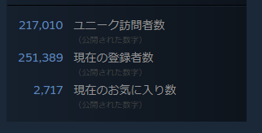
 
### etc
- 官公庁向けエンジニアリング、講師など

## 2023

### Games
- 海外ゲーム翻訳MOD コアメンバー
  - 利用者11万人超

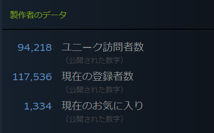

### 3D/Modelings
- VRChat向けワールドギミック販売
- VRChatワールド作成

### Certification
- Google Data Analytics Professional

## 2022

### Desktop App
- Java製ユーザー参加型ゲームアプリ
- コア技術
  - Java / firebase(ホスティング) 他

### Certification
- Google for Education Certified Educator lv1

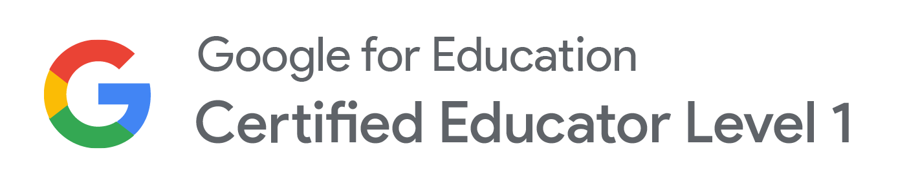{:height="50%" width="50%"}

## 2021

### web1

- アニメーション動画と連動したリズムゲーム ～1 月~
- コア技術
  - firebase(auth,store,hosting) / Phaser / Node 他
- 詳細非公開

### web2
- HTML5ゲームの作成補助サイト~
- コア技術
  - GCP (GAE/GCS) / react(SSG) / Typescript 他

### Desktop app
- AI技術を利用した短文小説の自動生成アプリ~
- コア技術
  - GPT-2 / HuggingFace / Python3 /PyQt 他

### Certification
- Google Cloud Fundamentals: Core Infrastructure

## 2020

### web

- 特定公開データの自動収集・閲覧サービス(テスト運用中) 2 月~
- コア技術
  - GCP (GAE/GCS) / Node / ServiceWorker 他
- 詳細非公開

### web2

- ユーザー参加型ノベルゲームサイト 3 月~12 月
- コア技術
  - GCP(GCS) / firebase(auth,store) / Phaser / Node 他
- 詳細非公開

### web3

- アニメーション動画と連動したリズムゲーム 11 月
- コア技術
  - firebase(auth,store,hosting) / Phaser / Node 他
- 詳細非公開

## 2019

### 動画製作

- 17 本
- aviutil / 他

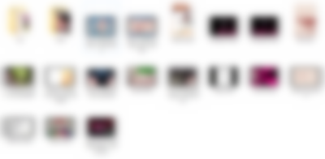

### web

- 二次創作者参加型キャラクターゲーム
- 詳細非公開
- githubpages / RPG ツクール MV / ClipStudio

### 非電源ゲーム

- ゲームマーケット 2019
- [実食系カードゲームレシピ集](http://gamemarket.jp/game/%e5%ae%9f%e9%a3%9f%e7%b3%bb%e3%82%ab%e3%83%bc%e3%83%89%e3%82%b2%e3%83%bc%e3%83%a0-%e3%83%ac%e3%82%b7%e3%83%94%e9%9b%86/)

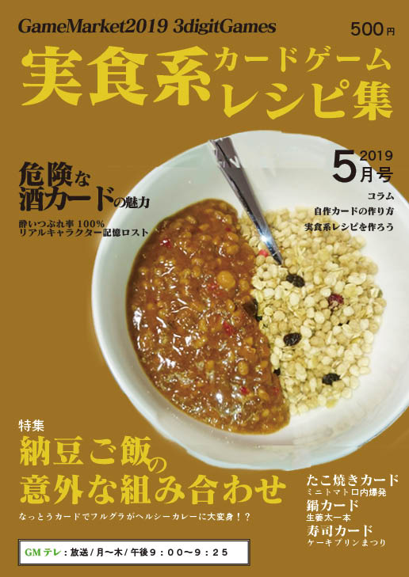{:height="50%" width="50%"}

## 2018

### GoogleHome アプリ 1

- つくば市のごみカレンダー(2019/03 稼働停止)

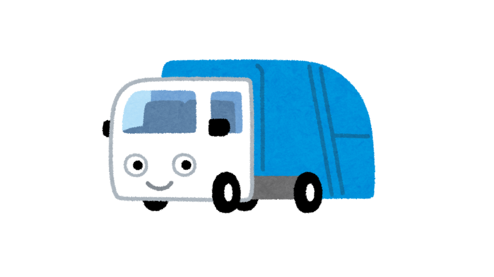{:height="50%" width="50%"}
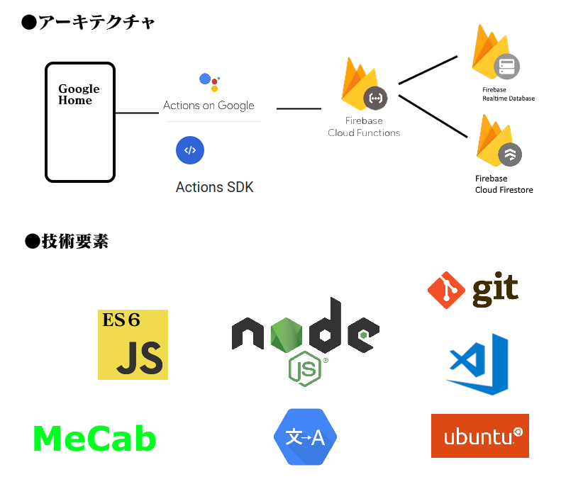

### GoogleHome アプリ 2

- interval timer (2019 稼働停止)

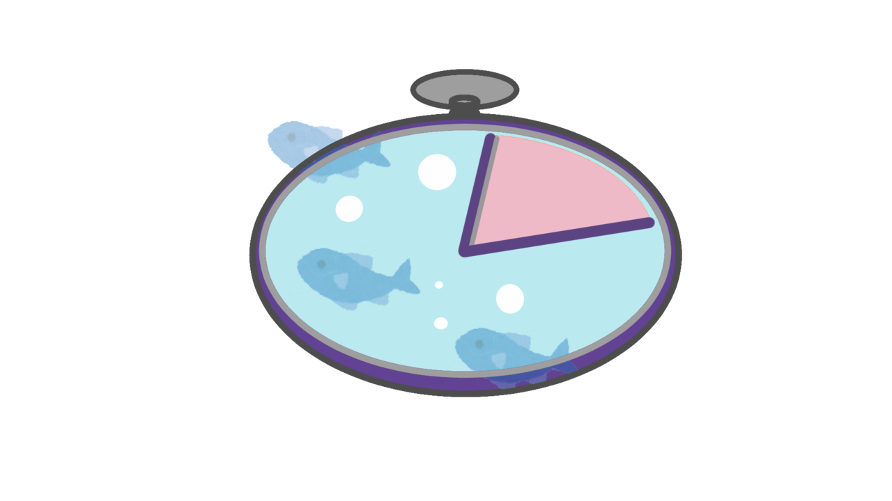{:height="50%" width="50%"}
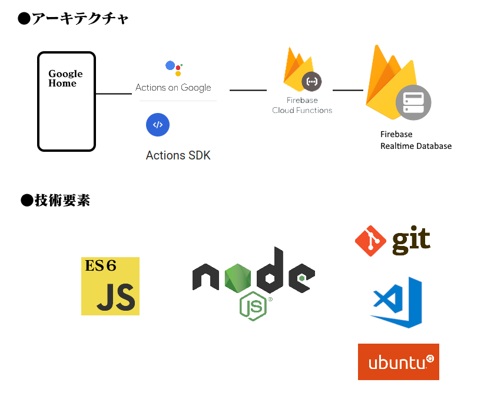

### Chrome 拡張アプリ

- List Back Image for Trello (メンテナンス停止)

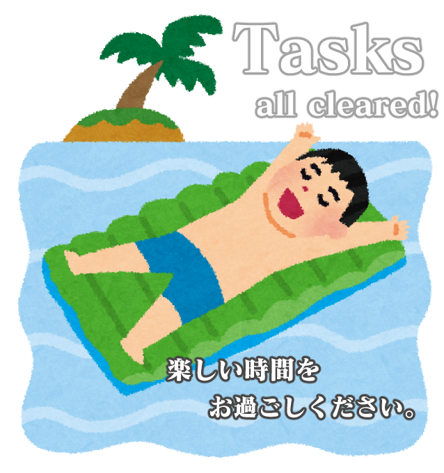{:height="50%" width="50%"}
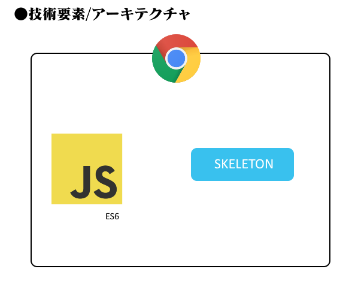

## 2016

### web

- 小説分析用 SPA サイト (2020/03 稼働停止)

{:height="50%" width="50%"}

### 2015

### android

- 感じど忘れ思い出しアプリ

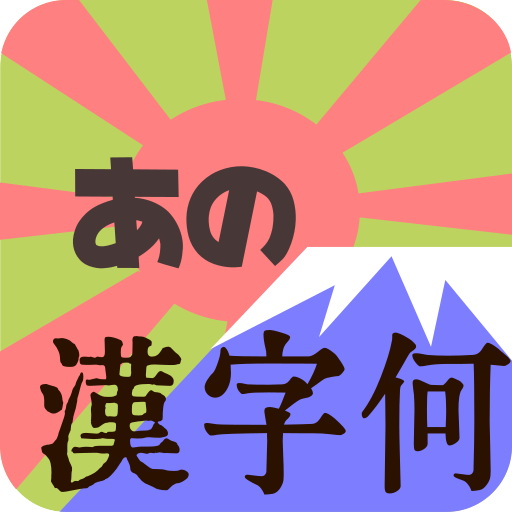{:height="50%" width="50%"}
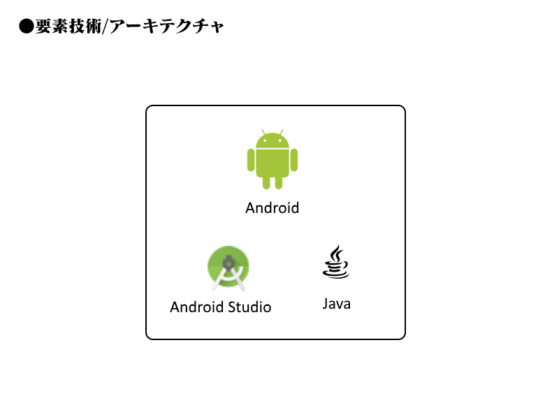
