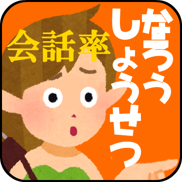
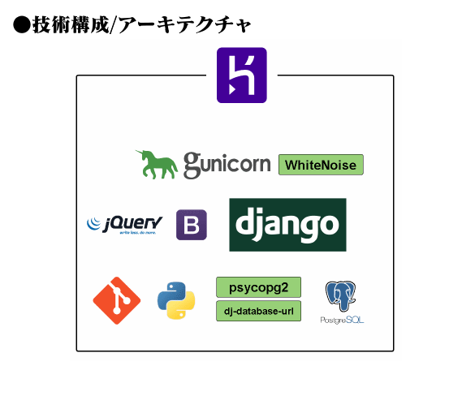

# umi-chaaahanのポートフォリオサイトです
作った物を掲載。

## 2020
### 特定公開データの自動収集・閲覧サービス(テスト運用中) 2月～
(構成図を貼る)

### ユーザー参加型ノベルゲーム(試作中) 3月~
(構成図を貼る)

## 2019
### 二次創作者参加型スロットゲーム
(構成図貼る)

### 実食系カードゲームレシピ集
- ゲームマーケット2019に参加
(その他情報)

## 2018
### GoogleHomeアプリ1
- つくば市のごみカレンダー(2019/03 稼働停止)

### GoogleHomeアプリ2
- interval timer (2019 稼働停止)

### Chrome拡張アプリ
- List Back Image for Trello (メンテナンス停止)

## 2016
### web
小説分析用SPAサイト (2020/03稼働停止)
{:height="50%" width="50%"}

### 2015
### android
感じど忘れ思い出しアプリ
{:height="50%" width="50%"}

